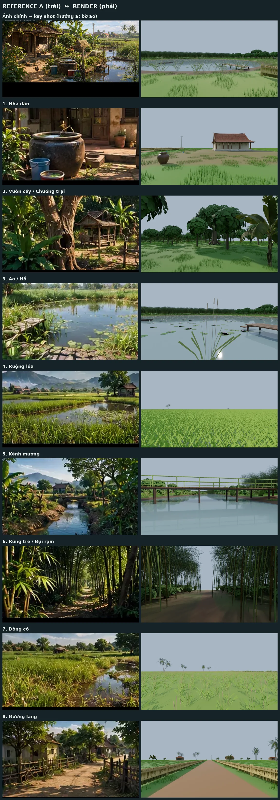

# M2 — Environment v1: kết quả và tự đánh giá

| | |
|---|---|
| Ngày | 2026-10-03 |
| Thực hiện | Claude |
| Trạng thái | **Xong bản v1, CHỜ CHỦ DỰ ÁN DUYỆT** (M2 = "phải giống VISUAL" → cần mắt người) |
| Key shot | Theo hướng **(a)** của [`M1_REVIEW.md §4`](../greybox/M1_REVIEW.md): giữ layout, khung hình chính đứng ở bờ Đông ao cạnh cầu ao (L08) |

## 1. Đã làm

- **33/34 asset P0 dựng bằng script** (`blender/scripts/make_assets.py`, procedural v1, đúng quy chuẩn
  ASSET_GUIDELINES §4: mét, gốc đáy-giữa, mặt trước −Y; texture tileable sinh bằng numpy, đóng gói trong GLB;
  lá dùng alpha-clip 2 mặt) + 5 asset P1 tiện làm luôn (`house_vn_03`, `old_tire`, `bamboo_hut_vn`,
  `shrub_tropical_02`, `fern_clump`). Contact sheet: [`../assets/procedural_v1.webp`](../assets/procedural_v1.webp).
  Còn thiếu: `water_buffalo` (đang dùng `cow.glb` CC0 làm fallback — là bò sữa trắng, **sai**, cần thay).
- **Vật liệu nền P0** (bùn bờ ao, bờ ruộng, bờ kênh, lá tre mục, đường đất, vũng) = bảng màu đỉnh địa hình theo
  ART_DIRECTION §3, có nhiễu biến thiên (`generate_terrain.py → LOOK`). Sân đất chỉ quanh nhà, còn lại là cỏ.
- **Shader nước** `godot/shaders/water_surface.gdshader` (gợn sóng, Fresnel, kênh có hướng chảy) — dùng cho ao,
  kênh, ruộng, vũng mưa.
- **Thực vật procedural**: ~170 nghìn điểm (tre 16k, lúa 33k, cỏ 73k, cỏ cao 12k, bụi 6k, sậy 3k, bèo 0.7k) +
  236 cây lớn/chuối/dừa.
- **Godot**: `godot/world/foliage_loader.gd` dựng thực vật bằng MultiMesh chia ô 64 m, có tầm nhìn tối đa theo loại;
  `greybox_viewer.tscn` tự nạp bản env, gán shader nước, ẩn vũng mưa (R = mưa, G = bật/tắt cây cỏ).
  Công thức đặt cây đã **đối chiếu với Blender**: lệch ≤ 3 mm (làm tròn JSON) trên 1 200 instance.
- **Pipeline**: `assets/_procedural/` (gitignore, sinh lại được) đứng sau `assets/environment|props|creatures`
  trong manifest → thả model AI 3D cùng tên là tự thắng bản procedural. Thêm `"align": "origin"` cho cầu, cầu ao, thuyền.

## 2. So sánh với Reference A

Chạy lại: `python blender/scripts/render_views.py` → `python blender/scripts/compare_reference.py`.

| Khung | Giống | Chưa giống |
|---|---|---|
| Key shot (bờ ao) | Ao + cầu ao + vườn/rừng tre phía sau, hàng rào tre | Thiếu mảng xanh rậm ven bờ, ánh sáng phẳng |
| 1 Nhà dân | Nhà mái ngói hiên cột, lu sành, xô, sân đất | Ảnh reference là cận cảnh hiên + lu; nhà v1 đơn giản, thiếu chậu cây, chi tiết tường cũ |
| 2 Vườn | Cây lớn, chuối, chòi | Tán cây dạng "chùm thẻ lá" còn đồ hoạ; thiếu lá mục, cây bụi tầng thấp |
| 3 Ao | Mặt nước, bèo, sậy, cầu ao | Nước chưa phản chiếu (M3), bờ trơ |
| 4 Ruộng | Lúa non dày, xanh tươi | Không thấy nước giữa khóm lúa; thiếu núi xa + chòi ở hậu cảnh của khung |
| 5 Kênh | Cầu ván qua kênh, cây ven bờ | Bờ kênh trơ, thiếu chuối/cây rậm hai bên |
| 6 Rừng tre | "Đường hầm tre" đúng bố cục | Tối (chưa có ánh sáng M3), lá tre thưa |
| 7 Đồng cỏ | Cỏ cao, dừa xa | Thiếu vũng nước (chỉ hiện khi mưa), thiếu cây lẻ |
| 8 Đường làng | Đường đất đỏ, rào tre hai bên, nhà + dừa | Rào thẳng tắp, thiếu cây tán lớn hai bên đường |

**Nhận định chung:** đúng **bố cục và thành phần** của từng zone (đạt mục tiêu "map đúng concept"), nhưng **chưa đạt
"giống visual"** về chất liệu và độ rậm. Phần thiếu chia 2 nhóm:

1. **Ánh sáng / mood → M3**: nắng giờ vàng, sương xa, phản chiếu nước, color grading (mọi ảnh hiện dùng trời xám phẳng).
2. **Chất lượng asset**: model procedural v1 là bản tạm. Cần model AI 3D (Meshy/Rodin/Tripo) cho nhà, lu, chòi,
   cầu ao, thuyền, trâu; cây/cỏ/tre lấy từ asset library CC0 (Poly Haven, Quixel…). Môi trường của Claude không truy
   cập được các dịch vụ này → bước này cần làm trên máy của bạn rồi thả file vào `assets/`.

## 3. Đề xuất

- **Duyệt M2 v1 ở mức "bố cục + thành phần đúng"** để mở M3 song song với việc thay asset thật, **hoặc**
- Giữ M2 mở cho tới khi có ≥ 10 asset thật ưu tiên: `house_vn_01`, `house_vn_02`, `water_jar_vn`, `bamboo_clump_01/02`,
  `rice_patch_1m`, `coconut_palm`, `banana_clump_vn`, `bamboo_fence`, `water_buffalo`.

Đã kiểm tra lại M1 sau khi thay đổi: `check_greybox.py` vẫn 15 PASS / 1 WARN / 0 FAIL.
