# M1 — Biên bản duyệt 3D Greybox

| | |
|---|---|
| Ngày | 2026-10-03 |
| Người duyệt | Claude, thay mặt chủ dự án (theo yêu cầu "duyệt M1 cho tôi luôn") |
| Cách duyệt | Không có Godot trong môi trường duyệt → kiểm tra tự động (`check_greybox.py`) + render Cycles CPU (`render_views.py`) từ cùng file `blender/master_map.blend` mà `greybox_viewer` dùng |
| Kết luận | **ĐẠT** — layout khớp MAP_BIBLE, đã sửa 7 lỗi phát hiện trong lúc duyệt. **1 điểm mở** cần chủ dự án quyết định trước M2 (mục 4) |

## 1. Kiểm tra tự động

Chi tiết: [`M1_check.md`](M1_check.md) — 15 PASS, 1 WARN, 0 FAIL. Chạy lại: `python blender/scripts/check_greybox.py`.

## 2. Lỗi tìm thấy và đã sửa

| # | Lỗi | Phát hiện bởi | Sửa |
|---|---|---|---|
| 1 | Cầu R2 dài 16 m, lệch tâm kênh 3 m → đường lọt xuống nước, một đầu cầu ở y = −1.06 | check | Cầu dời về (111, 100), dài 24 m (Bible §4, L09) |
| 2 | Điểm đẻ trứng W07 nằm đúng giao điểm hai bờ ruộng → khô | check | Dời (406, 297) → (385, 282), giữa một thửa (Bible §6, §11.1) |
| 3 | Bờ R4 (z = 300) cách bờ thửa (z = 297.5) chỉ 2.5 m → hai bờ song song | check + ảnh | Bờ thửa căn theo R4: mỗi nửa ruộng 3 hàng thửa (Bible §5 `plots`) |
| 4 | Bờ R4 không nối với đường nào | check | R4 kéo tới R1, qua kênh nhánh bằng cống L11 (Bible §4) |
| 5 | Kênh nhánh (mặt nước 0.0) đổ vào kênh chính (−0.3) → hở ở chỗ hợp lưu | check | Mặt nước kênh nhánh −0.25 m, đáy −1.05 m (Bible §5, §9) |
| 6 | Mép nền nhà hụt 0.15–0.22 m (lưới 2 m) | check | Nền nhà rộng thêm 1 ô lưới |
| 7 | Mặt nước kênh gấp nếp ở khúc cua; mép nước răng cưa nâu; ô đen ở ngã ba R1–R2 | ảnh | Tiếp tuyến phân giác ở điểm nối; chỉ tô màu lòng kênh chìm; nâng đường chính hơn đường nhánh 1 cm |

## 3. Ảnh duyệt

| | |
|---|---|
| 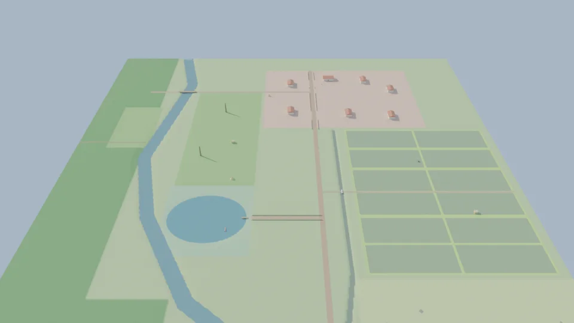 toàn cảnh | 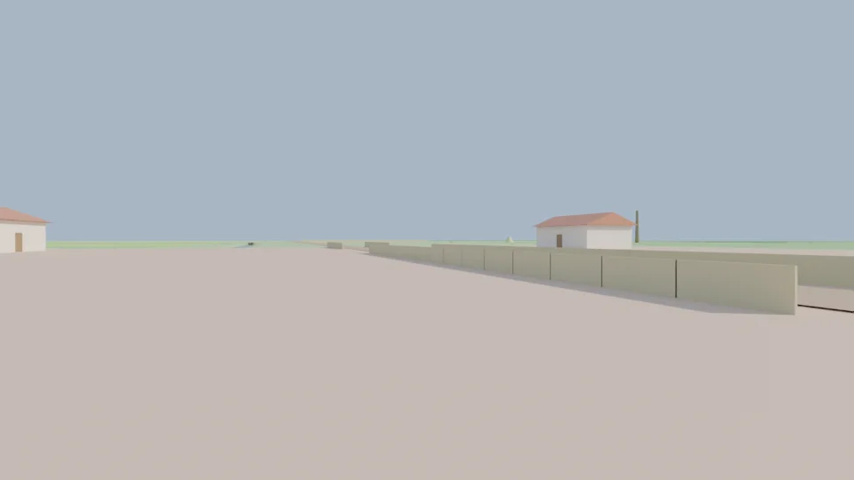 tầm mắt người, sân H01 |
| 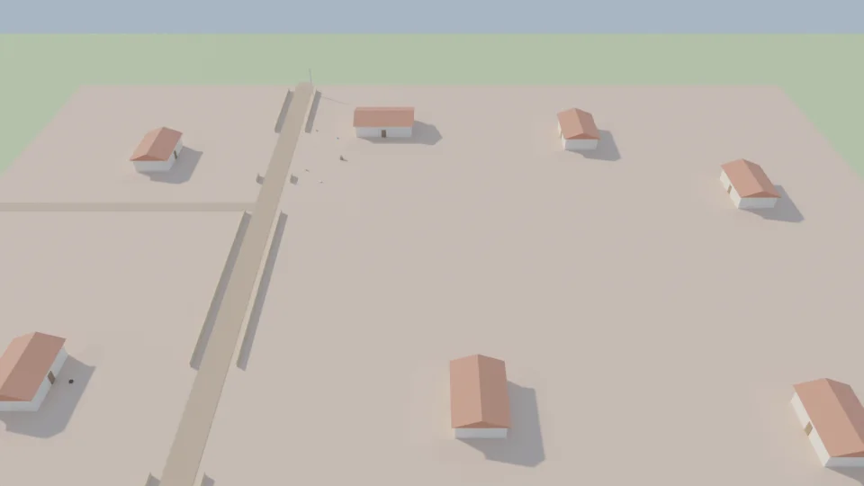 1 Nhà dân | 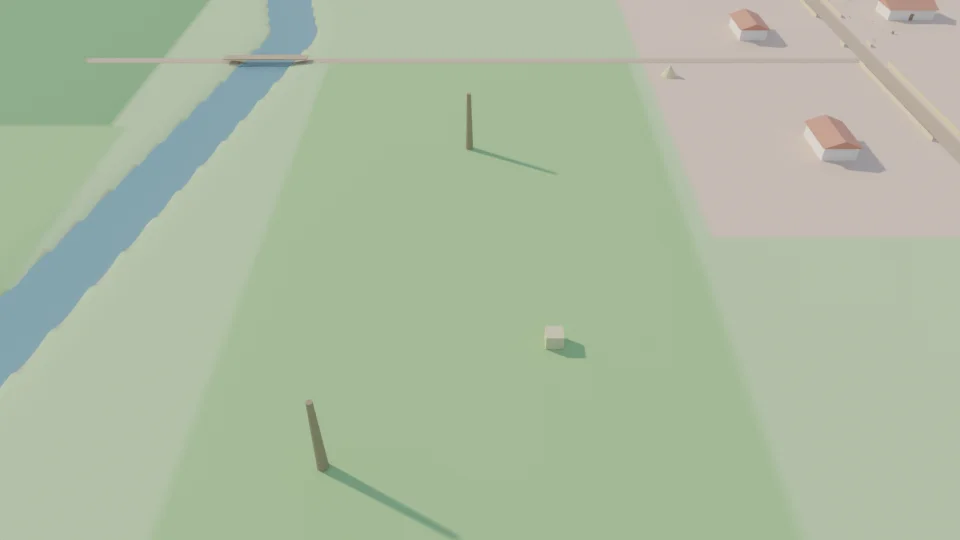 2 Vườn |
| 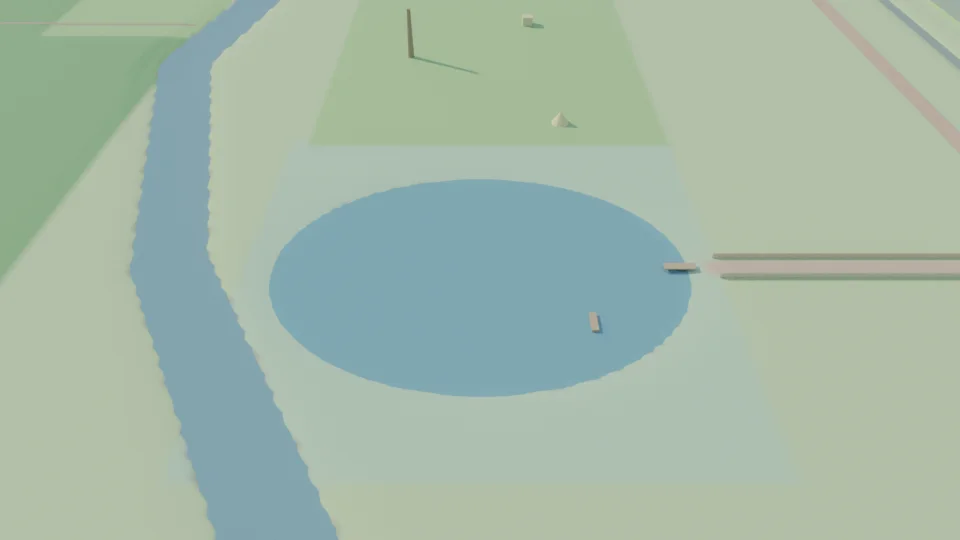 3 Ao | 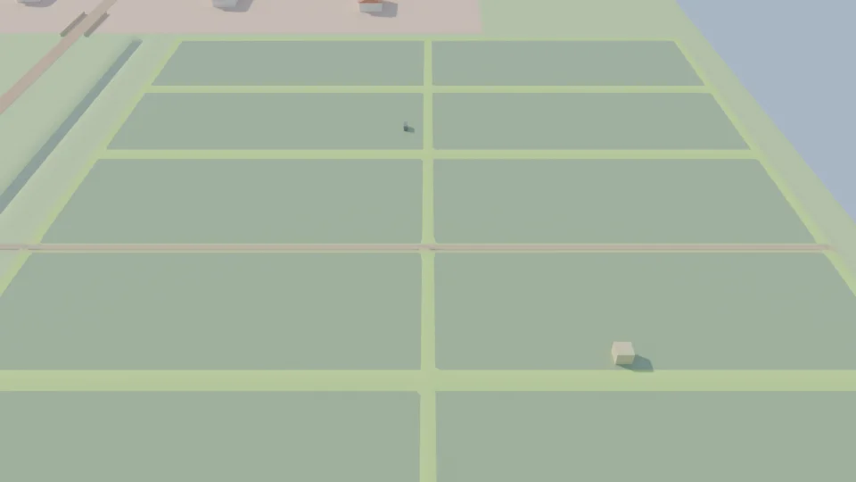 4 Ruộng |
| 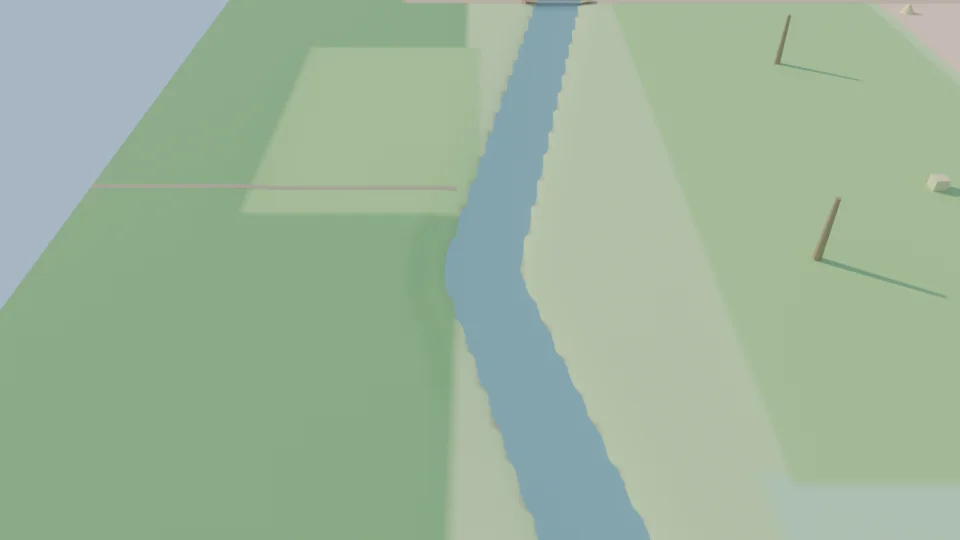 5 Kênh | 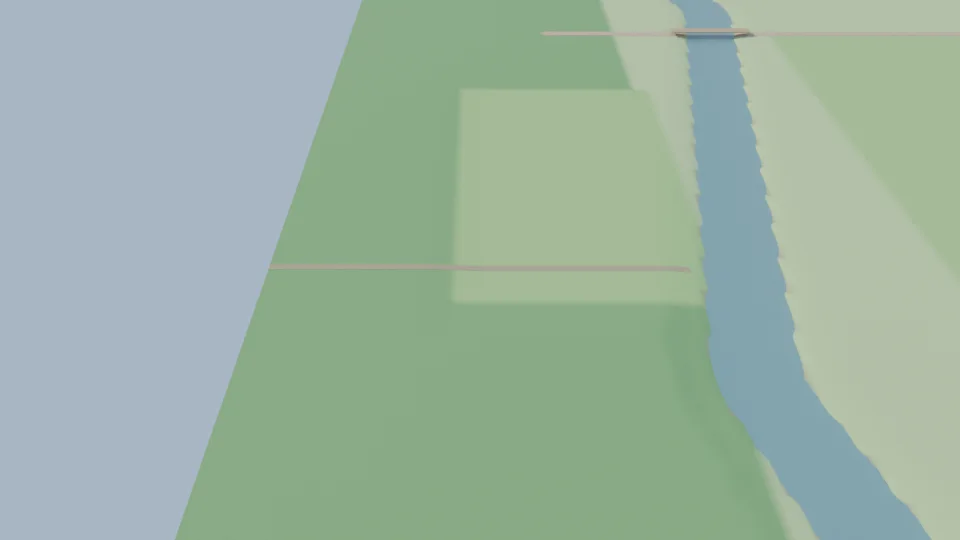 6 Rừng tre |
| 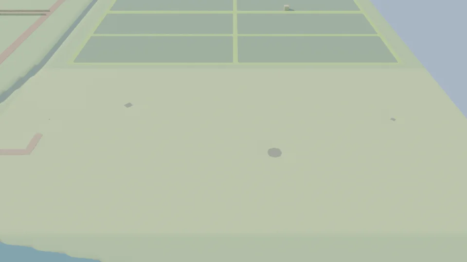 7 Đồng cỏ | 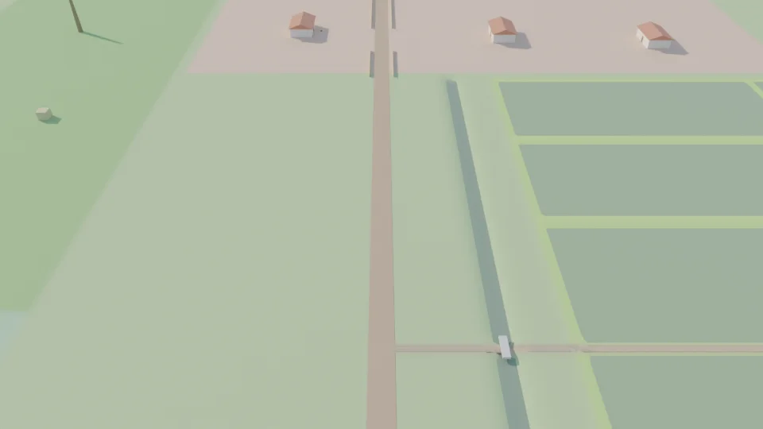 8 Đường làng |
| 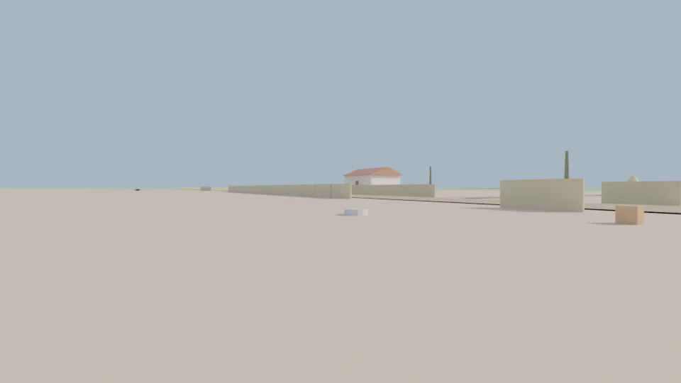 tầm muỗi, cạnh chum W03 | |

Chạy lại: `python blender/scripts/render_views.py` (Cycles CPU, ~1.5 phút cho 11 ảnh).

## 4. Điểm mở — CẦN CHỦ DỰ ÁN QUYẾT ĐỊNH trước M2

**Khung hình chính (key shot) mâu thuẫn giữa Reference A và Reference B.**
Ảnh chính trong reference cho thấy *nhà – sân có lu/xô – ao ngay trước mặt*. Theo minimap (Reference B), ao Z03 cách
nhà H01 ~270 m, giữa là vườn; đứng ở sân H01 không thể thấy ao (xem `09_key_shot.webp`).
Theo luật ở `ART_DIRECTION.md`, **B thắng về vị trí**, nên greybox giữ nguyên. Hai hướng cho M2:

- **(a) Giữ layout, đổi key shot**: chụp từ bờ Đông của ao (đường R3, gần cầu ao L08) nhìn về Tây/Tây-Nam —
  tiền cảnh cầu ao + thuyền, trung cảnh ao, hậu cảnh vườn + rừng tre. Không sửa Bible.
- **(b) Thêm một nhà cạnh ao** (VD: H08 ở rìa Tây Z03, gần cầu ao) để dựng lại đúng khung hình. Phải sửa Bible §3/§7
  (Z01 hiện là rect riêng ở Đông-Bắc) → thay đổi layout.

## 5. Chấp nhận, xử lý ở milestone sau

- Khu Nhà dân rất trống (205 × 145 m, 7 nhà): đúng với greybox; chuối, dừa, cỏ, rào sân sẽ lấp ở **M2**.
- Mép nước hơi răng cưa ở lưới 2 m: bản cuối xuất với `--res 1`.
- Đường mòn rừng tre T1 không nối với R1 (WARN): là lối mòn trong rừng; muỗi bay tới được. Xem lại ở M4 nếu cần NPC đi bộ.
- Chưa mở được trong Godot thật: `greybox_viewer` mới được kiểm cú pháp (gdtoolkit). Khi có Godot, chạy F6 để kiểm lại.
