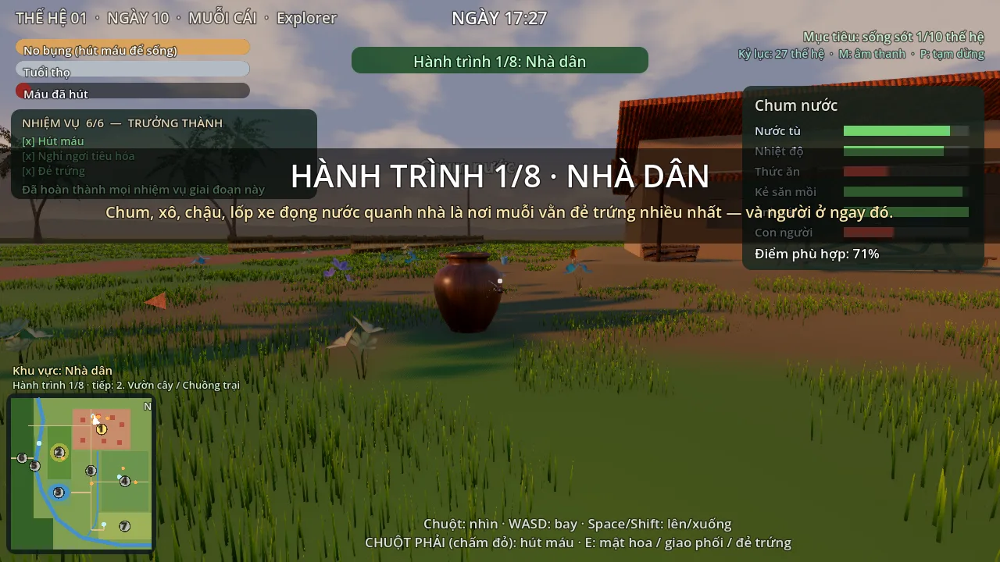
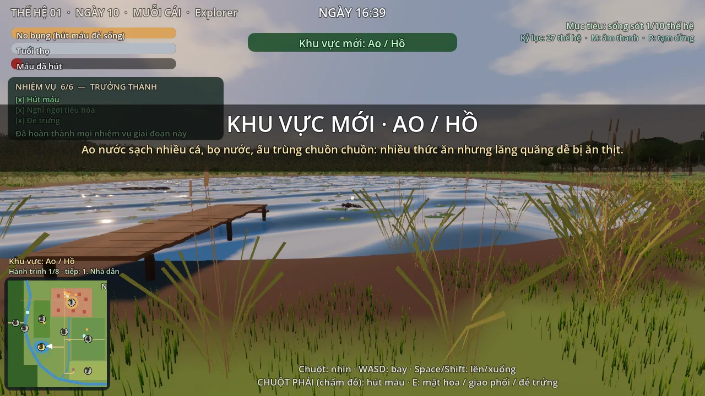
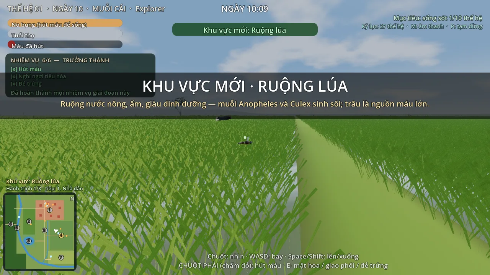
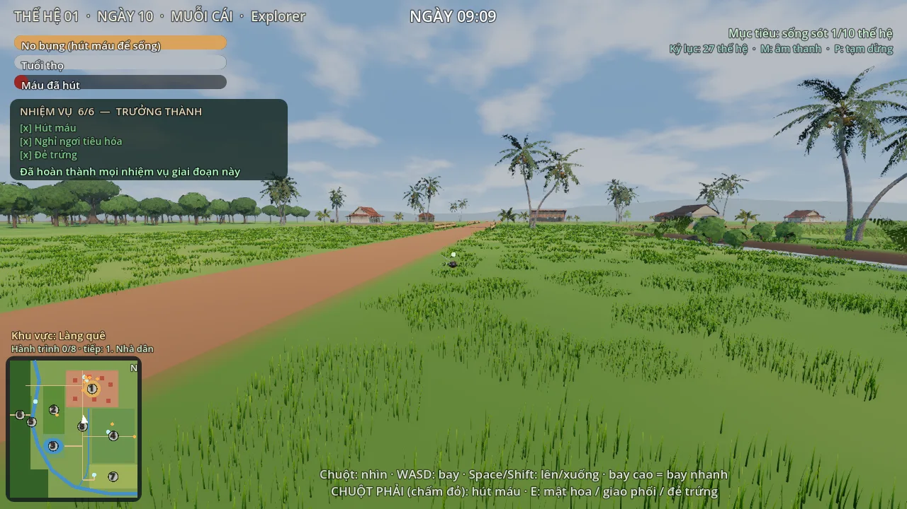
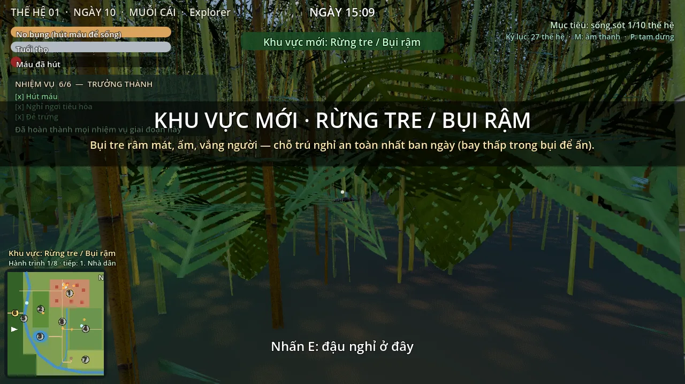
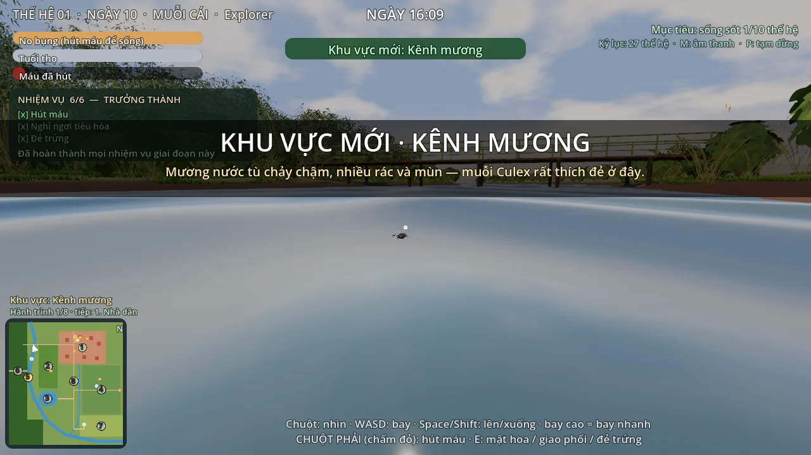
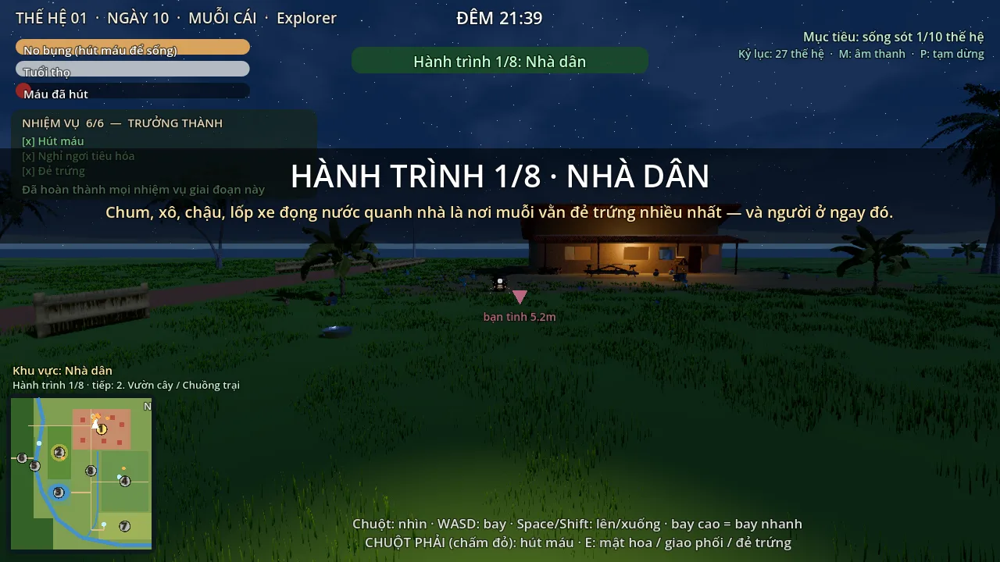
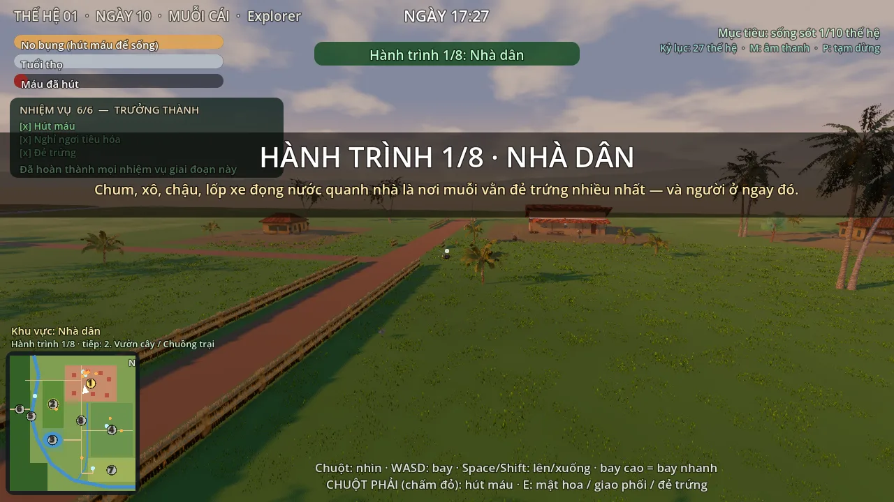

# M4 — Gameplay trong map làng: kết quả và tự đánh giá

| | |
|---|---|
| Ngày | 2026-10-05 |
| Thực hiện | Claude |
| Trạng thái | **Xong bản v1, CHỜ CHỦ DỰ ÁN CHƠI THỬ** — lần đầu **chạy thật trong Godot 4.7** (headless + render Vulkan/llvmpipe trên CPU), không chỉ kiểm cú pháp |

## 1. Đã làm

Giai đoạn muỗi trưởng thành giờ bay trong **map làng thật 500 × 540 m** (map M1–M3), không còn thế giới nén 76 × 48 m.

| Hạng mục (ROADMAP M4) | Cách làm |
|---|---|
| Nạp map trong game | `godot/world/village_map.gd` (dùng chung với `greybox_viewer`): GLB + 97 580 cây cỏ MultiMesh + ngày–đêm M3 + **va chạm địa hình** (HeightMapShape3D từ lưới 1 m) + khối va chạm cho các nhà H02–H07. Nạp ~0,8 s |
| Nhà có nội thất | Gốc toạ độ thế giới trưởng thành = `HousePoint_01` → nhà có phòng, giường, gia đình… của game nằm **đúng chỗ nhà H01** (14,4 × 9,4 m, hướng Nam — khớp sẵn), mọi toạ độ trong nhà giữ nguyên. Model H01 của map được ẩn |
| `SITES` → toạ độ chuẩn (§6, §11.1) | `Game.site_pos()/site_wy()` lấy từ `EggSite_*` (`game_site`): mặt nước trong chum/xô đo từ model đã đặt, ao/kênh/ruộng lấy mặt nước của map |
| Spawn | Lần đầu vũ hóa tại `PlayerSpawn_FirstLife` = chum W03 |
| Giới hạn bay (§12) | `playable_rect` [10,10,490,530], trần 25 m, không chui xuống đất (theo độ cao địa hình) |
| Làng rộng | Bay cao nhanh hơn: 2,5 m/s sát đất → 6,5 m/s ở ≥ 7,5 m |
| Người & vật nuôi theo zone (§13) | Z01: gia đình trong nhà, chó, mèo, chuột, chim, **gà mái (L04)** · Z02: **lợn (L07)** · Z04: **trâu (L10b)** + **bác nông dân** đi trên bờ ruộng R4 · Z08: **người qua đường** trên R1 (2 người này về nhà ban đêm) |
| Kẻ săn muỗi theo zone | Chuồn chuồn ở ao Z03 (2), ruộng Z04, kênh Z05, đồng cỏ Z07, vườn; Z06 rừng tre: bay thấp = ẩn, đậu nghỉ được |
| Kẻ thù dưới nước theo loại nước (§6) | `SITES.wtype` (temporary / container / clean_still / stagnant_slow / shallow_nutrient) — `pond.preds` đã theo loại nước: ao = cá + bọ + ấu trùng chuồn chuồn + gọng vó, kênh = cá + gọng vó, ruộng = bọ + ấu trùng + gọng vó, xô = không |
| Nhiệm vụ theo hành trình 1 → 8 | Bay vào **đúng chặng kế tiếp** = +1 nhiệm vụ (tăng số trứng qua `q_bonus`) + bảng thông tin khu vực; khu vực mới ngoài thứ tự vẫn được ghi nhận. Tiến độ giữ qua các thế hệ. Thành tựu "Thông thạo cả 8 khu vực" |
| Minimap | Vẽ cả làng (zone, đường, kênh, ao, ruộng, nhà, nguồn nước), số khu vực theo hành trình, **chặng kế tiếp nhấp nháy** |
| Nguồn mật / chỗ ẩn | ~60 bụi hoa quanh sân, cạnh nguồn nước, vườn, đồng cỏ; 241 chỗ ẩn (chuối, dừa, cây vườn, đống rơm, cây đa, chòi) |

Không có `godot/world/generated/` → game tự dùng thế giới nén cũ (`-- --legacy-world` để ép).
Map đã sinh được **commit sẵn** (≈ 42 MB) để chạy game không cần Blender.

## 2. Kiểm thử (Godot 4.7, chạy thật)

```
godot --headless --fixed-fps 60 --path godot --quit-after 300 -- --scenario=test_village   → ĐẠT (0 lỗi, 40 mục)
godot --headless --fixed-fps 60 --path godot --quit-after 1500 -- --scenario=test_rules    → như trước M4
godot --headless --fixed-fps 60 --path godot --quit-after 14000 -- --scenario=auto         → 27 thế hệ không lỗi
```

`test_village` kiểm: 6 nguồn nước đúng điểm Bible + đúng zone + trong vùng bay; vũ hóa tại W03; nền nhà H01;
vùng bay = playable_rect; không vượt trần / không chui đất; tốc độ bay cao; vị trí người & vật theo zone;
người ngoài đồng về nhà ban đêm; hành trình (đúng thứ tự / ngoài thứ tự / thưởng); số hoa & chỗ ẩn.

Ảnh trong game (`--scenario=adult_v_<cảnh>`), render Forward+ (Vulkan/llvmpipe):

| | |
|---|---|
|  chum W03 — nơi vũ hóa lần đầu, 17h |  ao Z03 — cầu ao, sen, sậy |
|  ruộng lúa Z04 — trâu ở xa |  đường làng R1, 9h |
|  rừng tre Z06 — "Nhấn E: đậu nghỉ" |  kênh Z05 |
|  sân nhà ban đêm — đèn nhà, bạn tình |  bay cao 9 m trên làng |

## 3. Sửa lỗi M3 phát hiện khi chạy Godot thật

- **Sương trong Godot dày gấp ~6 lần ảnh duyệt Blender** (Blender nhân 0,15, Godot dùng thẳng) → cả cảnh bạc màu.
  Thêm `fog_scale: 0.15` vào `docs/art_look.json`, cả `lighting.py` và `day_night.gd` cùng dùng (ảnh Blender không đổi).
- Mặt nước nhìn sát (tầm muỗi) chói trắng như gương → `water_surface.gdshader` roughness 0,06 → 0,14, giảm phản xạ
  (kênh nhìn xiên vẫn còn sáng — xem §4).
- `.gdignore` trong `world/generated/` (GLB nạp lúc chạy) → Godot không còn import/giải nén texture rác ra thư mục.

## 4. Còn mở

- **Hiệu năng trên máy thật**: ở đây chỉ có CPU (llvmpipe ~1 fps) nên chưa đo FPS; cần chạy trên máy chủ dự án
  (map + 97k cây cỏ + bóng đổ 250 m + nhà có nội thất).
- Cân bằng độ khó: khoảng cách nhà → ruộng 230 m, → kênh 231 m, → ao 306 m, → vũng đồng cỏ 386 m (bay cao ≈ 35–60 s;
  muỗi cái sống 400 s); chum/xô ngay sân nên đẻ gần nhà vẫn dễ nhất. Chuồn chuồn ở ao khá nguy hiểm.
- Người qua đường / nông dân dùng logic "vật chủ đi lại" (không có tay đập như người trong nhà).
- Hiên nhà, mái nhà có nội thất là khối đơn giản của game cũ; model H01 thật (`house_vn_01`) chưa có nội thất.
- Mặt kênh/ao nhìn xiên sát mặt nước vẫn sáng bạc (phản chiếu trời) — reference A nước kênh xanh rêu đục hơn;
  cần chỉnh shader nước riêng cho tầm nhìn muỗi (độ đục, màu theo loại nước).
- Minimap "Hành trình x/8" đếm mọi khu đã tới (kể cả ngoài thứ tự); chặng thưởng chỉ tính đúng thứ tự.
