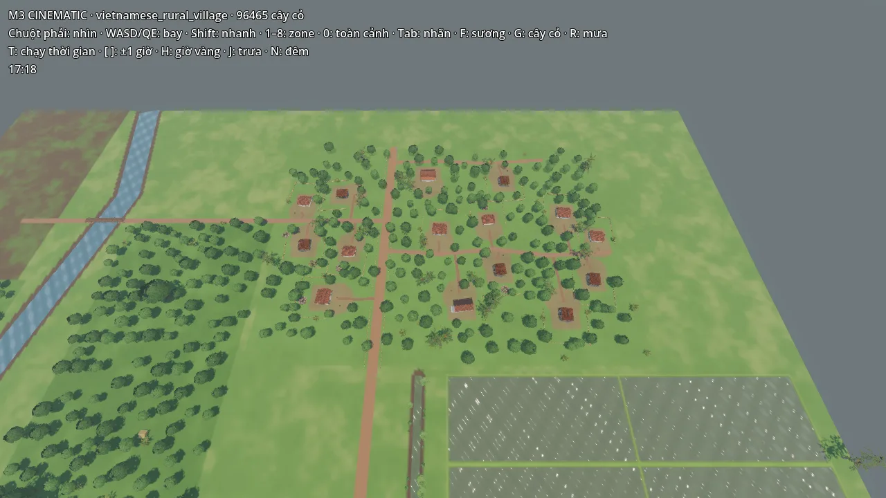
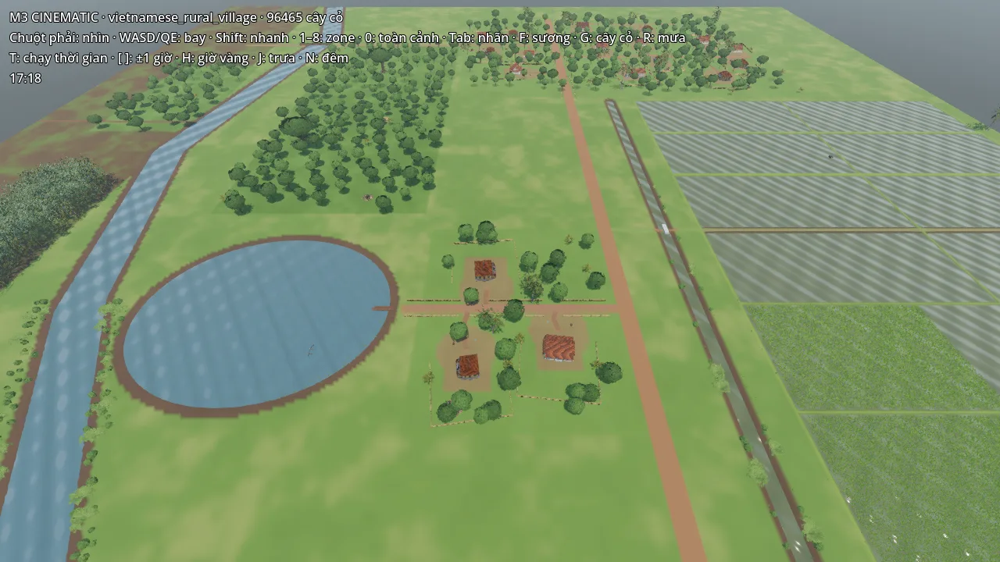
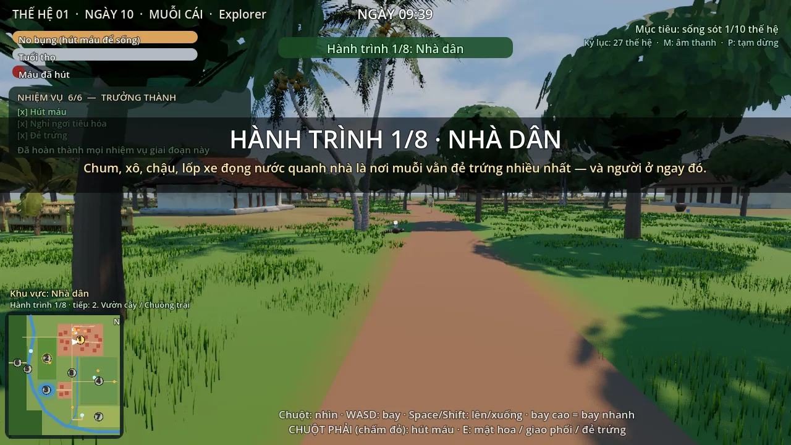
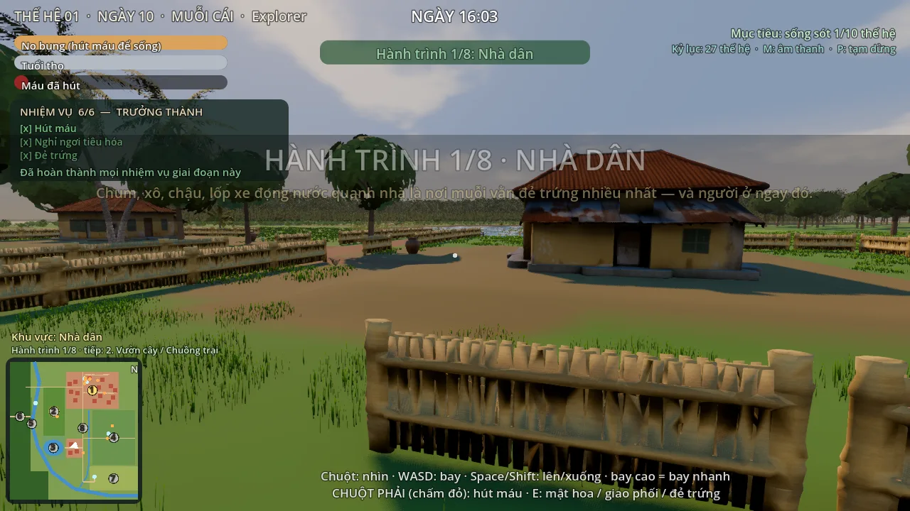
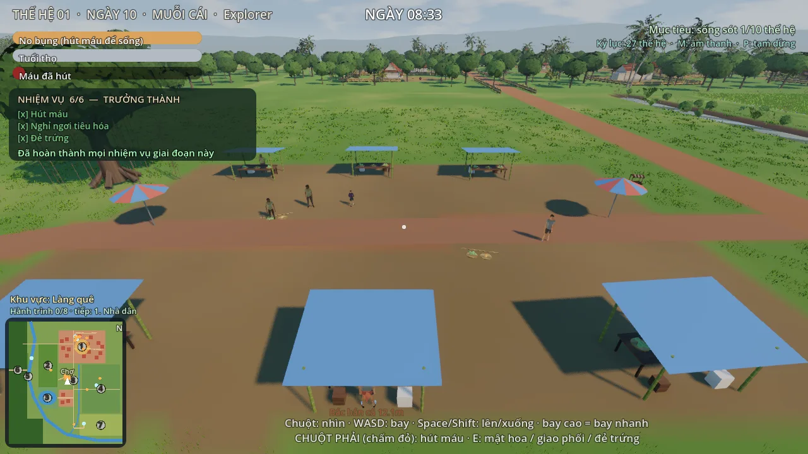
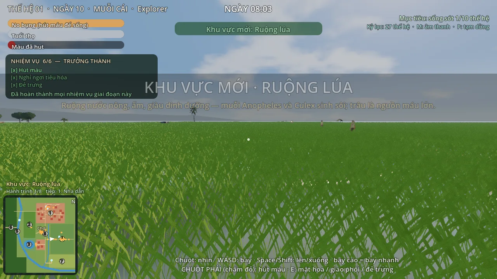
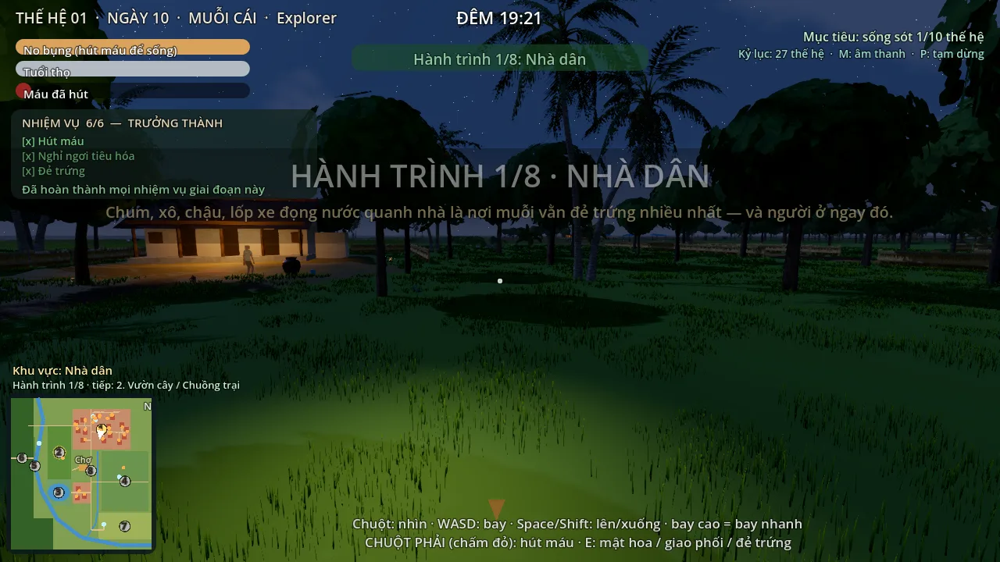
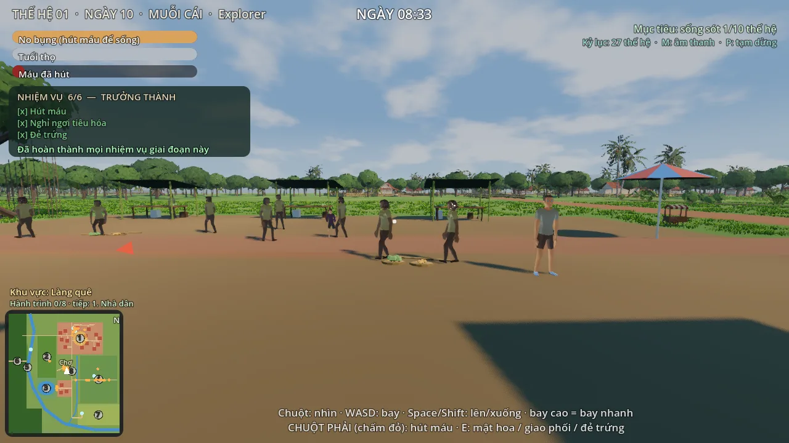

# MAP v2 — làng đông đúc, tự nhiên hơn (2026-10-05)

Phản hồi của chủ dự án sau M4: *"chỉ có vài nhà cách xa nhau quá, nhìn map trống trải"* — muốn một **làng thật**
(cụm nhà + ngõ nhánh + vườn/ao xen giữa), phạm vi sửa nhỏ.

## Đã đổi (không đổi kích thước map, 8 zone, nước, ruộng, điểm đẻ trứng, nhà chính H01)

| | v1 | v2 |
|---|---|---|
| Số nhà | 7, cách nhau ≥ 25 m | **18**, 3 xóm, cách nhau ≥ 16 m, lệch hướng 3–8° |
| Đường | R1–R5 + lối mòn tre | + **ngõ N1** (xóm Đông), **ngõ N2** (sau H01), **lối nhỏ** từ cửa từng nhà ra đường gần nhất (tự sinh) |
| Xóm ao | — | 3 nhà dọc R3 sát ao làng (Z01 thêm rect [220,300,282,375]) |
| Lô đất mỗi nhà | sân đất vuông | sân bo tròn phía cửa · chum, xô, chậu · gà · đống rơm · 2–3 cây ăn trái · chuối hai bên · dừa · rào tre sau + hai bên |
| Vườn | chỉ trong Z02 | cây ăn trái xen giữa các nhà khắp Z01, thưa dần ra mép làng (không thẳng theo hình chữ nhật) |
| Game | — | thêm bác hàng xóm đi trên ngõ N1 ban ngày; cây vườn + đống rơm = chỗ ẩn/đậu (241 → 528) |

Số liệu: `docs/map_spec.json` (houses.list, houses.lots, roads.N1/N2, zones.Z01) · Bible §7 + changelog ·
code: `common.add_footpaths()`, `generate_village._lots()`, `generate_terrain` (sân), `generate_foliage` (mép vườn).

## Ảnh (Godot 4.7)

| | |
|---|---|
|  làng chính nhìn từ trên |  xóm ao cạnh ao làng |
|  ngõ N1 ở tầm muỗi |  xóm ao ở tầm muỗi |

Bố cục 2D: [`../layout/01_house.png`](../layout/01_house.png)

## Chưa làm (để giữ phạm vi nhỏ)

- ~~Chợ nhỏ ở ngã ba~~ → **v2.1 đã làm** (xem dưới). Còn: cổng làng, giếng/ghế đá quanh ao.
- ~~Người dân sống theo lịch~~ → **v2.2 đã làm** (xem dưới).

## v2.1 — Chợ làng

Ngã ba R1 × ngõ M1, sân 34 × 22 m giữa làng chính và xóm ao: 6 sạp mái bạt (rau, quả, ớt, cá), 2 chỗ bán ngồi đất,
2 ô che, xe đẩy, cây bóng mát. Model procedural mới: `market_stall_vn`, `produce_basket_vn`, `market_umbrella_vn`
(`blender/scripts/assetgen/assets_v1.py`). Trong game: 3 người bán + 3 người mua chỉ có mặt giờ họp chợ
(5h30–11h, 15h–18h); bay vào chợ hiện "Chợ làng" (khu Z08 — nguy hiểm nhất); minimap vẽ ô chợ.

| | |
|---|---|
|  chợ sáng ở tầm muỗi |  chợ nhìn từ trên |

## v2.2 — Người dân sống theo lịch

1–2 người mỗi nhà H02–H18 (29 người, vai: nông dân · người buôn bán · cụ già · em bé), lịch trong `adult.gd → RES_SCHED`,
ghi trong MAP_BIBLE §13 `residents`. Đi theo mạng đường làng (A* trên mọi đường/ngõ/lối nhỏ — `VillageMap.build_paths/route`);
ở xa muỗi (> 60 m) thì đi nhanh và ẩn để kịp lịch của ngày 75 giây, lại gần thì thấy đi bộ thật.
`test_village` kiểm: 8h ra đồng/chợ/ao/đi học, 12h30 nghỉ trưa trong nhà, 19h hóng mát, 22h vào nhà; ≈ 1,5 ms/khung cho cả làng.

| | |
|---|---|
|  8h — nông dân trên bờ ruộng |  19h20 — hóng mát trước nhà |
|  chợ sáng có thêm người làng đi chợ | |
